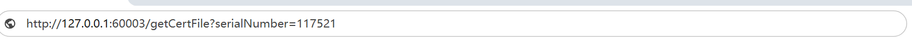
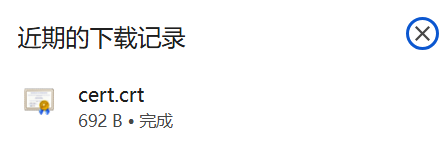

# 节点证书API

## wallet_getAddLatcSaintCodeNew

## 获取添加共识节点的code

参数：[]Param

Param:

|         |                |             |
| ------- | -------------- | ----------- |
| Address | 节点地址       |             |
| Pwd     | 节点账户的密码 | 用于读取key |

> 地址对应的fileKey需要在data/accountKey目录下

示例：

```json
{
    "jsonrpc": "2.0",
    "method": "wallet_getAddLatcSaintCodeNew",
    "params": [
       [
        {
            "Address": "zltc_Xmk6g2Lgxitrx4xEPUZgF4hHdnHwDcBuU",
            "Pwd": "{{password}}"
        }
       ]
    ],
    "id": 481
}
```

返回值为16进制code

## wallet_getReplaceLatcSaintCodeNew

## 获取添加替换节点的code

参数：[]replaceSaint, pwd

<table>
  <tr>
    <th></th>
    <th></th>
    <th></th>
  </tr>
  <tr>
    <td rowspan="2">JsonObject</td>
    <td colspan="1">oldSaint</td>
    <td colspan="1">旧共识节点证书</td>
  </tr>
  <tr>
    <td colspan="1">newSaint</td>
    <td colspan="1">新共识节点地址</td>
  </tr>
   <tr>
    <td colspan="1">新共识节点地址的密码</td>
  </tr>
</table>

示例：

  ```json
  {
      "jsonrpc": "2.0",
      "method": "wallet_getReplaceLatcSaintCodeNew",
      "params": [
         {
           "oldSaint": "zltc_g2L1GFdBZW6wHRBs1uZNDWeHjvMErzwri",
           "newSaint": "zltc_QkgkBgN25yAG2V1jTtFoawGSPg6yHcvRb"
         },
         "{{password}}"
      ],
      "id": 481
  }
  ```

返回值为16进制code

## <span id="apiSignVote">wallet_getSignVote</span>

## 获取签名投票的code

参数：

- proposalId 提案ID
- pwd 投票人的账户密码

示例：

```json
{
    "jsonrpc": "2.0",
    "method": "wallet_getSignVote",
    "params": [
        "0x050000000070726f706f73616c5f6164647265737300000000000000003230323431313138", //certDisgest
        "{{password}}" // 节点密码
    ],
    "id": 481
}
```

返回：code

## wallet_getApplyNodeCertCode

## 获取申请节点证书的code

参数：

|          | 类型    |                                                      |
| -------- | ------- | ---------------------------------------------------- |
| certType | uint    | [证书类型](#dict_certType) 只有填写Client时有效（4） |
| orgName  | string  | 组织名: 预留，选填                                   |
| applies  | address | 申请者的账户地址                                     |

参数：

```json
      {
          "jsonrpc": "2.0",
          "method": "wallet_getApplyNodeCertCode",
          "params": [
              {
                 "certType": 0,
                 "orgName": "",
                 "applies": [
                  {
                       "address": "{{account}}"
                  }
                 ]
              }
          ],
          "id": 485
      }```
```

返回：code

## <span id="api_revokeCert">wallet_getRevokeNodeCertCode</span>

## 获取吊销节点证书的code

参数：

- []serialNumber

示例：

   ```json
   {
       "jsonrpc": "2.0",
       "method": "wallet_getRevokeNodeCertCode",
       "params": [
        [64910389297,3869,289799096046914671177019247265221074243]
       ],
       "id": 485
   }
   ```

返回：code

## <span id="api_revokeClient">wallet_getRevokeClientCode</span>

## 获取吊销见证节点所有证书的code

参数：

- []address: 想要吊销的节点地址

示例：

   ```json
{
    "jsonrpc": "2.0",
    "method": "wallet_getRevokeNodeCertCode",
    "params": [
     ["zltc_xxx"]
    ],
    "id": 485
}
   ```

返回：code

## wallet_getUploadPubkeyCode

## <span id="apiUploadPubKey">获取上传公钥的code</span>

参数：

- address  申请者账户地址
- pwd 密码

> 此方法要求 address的fileKey在节点的data/account目录下

示例：

```json
{
    "jsonrpc": "2.0",
    "method": "wallet_getUploadPubkeyCode",
    "params": [
        "zltc_Xmk6g2Lgxitrx4xEPUZgF4hHdnHwDcBuU",
        "password"
    ],
    "id": 485
}
```

返回：code

## wallet_getUpAndApplyCode 获取上传公钥并申请证书的code

参数：

- address
- orgName
- pwd

> 此方法要求 address的fileKey在节点的data/account目录下

示例

```json
{
    "jsonrpc": "2.0",
    "method": "wallet_getUpAndApplyCode",
    "params": [
        "zltc_Xmk6g2Lgxitrx4xEPUZgF4hHdnHwDcBuU",
        "",
        "password"
    ],
    "id": 485
}
```

返回：code

## 

##  <span id="apiLatcPublishCert">latc_publishCert</span>

## 发布证书

(发布完成后只能在当前节点查询到，但不影响其他节点验证)

参数：

- []公钥列表：需要颁发的节点的公钥

参数示例：

```json
{
    "jsonrpc": "2.0",
    "method": "latc_publishCert",
    "params": [
        [
        "04fcbde233790a99d150d364fc5dd59e759df2e825c5b130afe66099904c37913efef1b1713ca85f2dee4954e73f1a3ff0d33255dc1cab136a7eff3282ab66fb4f"
        ]
    ],
    "id": 485
}
```

返回值：证书序列号

```json
{
    "jsonRpc": "2.0",
    "id": 485,
    "result": [
        "123421523565",
        "493734294370"
    ]
}
```

## latc_revokeCert

## 吊销证书

(只在当前节点生效，在其他节点验证时非吊销状态)

参数: 节点密码

- []serialNumber, 序列化数组
- pwd, 当前节点的账户密码

参数示例

```json
{
             "jsonrpc": "2.0",
             "method": "wallet_revokeCert",
             "params": [
                 [
                 {
                     "serialNumber": 154
                 }
                 ],
                 "123456"
             ],
             "id": 485
}
```

返回值：吊销成功的证书序列号

```json
{
    "jsonRpc": "2.0",
    "id": 485,
    "result": [
        "247422"
    ]
}
```


## latc_checkCert

## 检查证书状态

参数

- 证书序列号

```
{
    "jsonrpc": "2.0",
    "method": "latc_checkCert",
    "params": [
        "247422"
    ],
    "id": 485
}
```

返回值:

- error:
    - serialNumber is not a number:  输入参数有误
    - notExist：证书在本节点不存在
- success
    - revoked： 证书被吊销
    - valid：有效

```json
{
    "jsonRpc": "2.0",
    "id": 485,
    "error": {
        "code": -32000,
        "message": "no this cert"
    }
}
```

```json
{
    "jsonRpc": "2.0",
    "id": 485,
    "result": "revoked"
}
```

## <span id="apiGetCert"> latc_getCert</span>

## 获取证书

参数：

- 证书序列号

```json
{
    "jsonrpc": "2.0",
    "method": "latc_getCert",
    "params": [
        "3279"
    ],
    "id": 485
}
```

返回值

- error
    - serialNumber is not a number:  输入参数有误
    - notExist：证书在本节点不存在
- success
    - 证书的pem格式

```
{
    "jsonRpc": "2.0",
    "id": 485,
    "result": "-----BEGIN CERTIFICATE-----\nMIIBpDCCATCgAwIBAgICDl8wCgYIKoEcz1UBg3UwSzFJMAkGA1UEBxMCMTUwDQYD\nVQQHEwZDbGllbnQwLQYDVQQHDCZ6bHRjX1htazZnMkxneGl0cng0eEVQVVpnRjRo\nSGRuSHdEY0J1VTAgFw0yNDExMTgwNzA5NTlaGA8yMTI0MTAyNTA3MDk1OVowSzFJ\nMAkGA1UEBxMCMTUwDQYDVQQHEwZDbGllbnQwLQYDVQQHDCZ6bHRjX1htazZnMkxn\neGl0cng0eEVQVVpnRjRoSGRuSHdEY0J1VTBZMBMGByqGSM49AgEGCCqBHM9VAYIt\nA0IABJPGUdYm5fJl3MI9MBZirrNaojTd4OkVcUahMTddewhNwOa3LtgBEjcxYdxO\n4YUXYMaTY3rhoCYbT4Zf/K2SwfmjAjAAMAoGCCqBHM9VAYN1A2IANmMlKLXz2mAt\n3JSTY1WZvLriY+xoKanwLQkWagfwTSZvXa+Kcf8qZ2+MNgiosfJN58t+y7wQ7yrp\nI8DfesmM6gGG1kVK7fBLvZ+Zu5yrrHme9nkV7Z1xm6zVBroD1qrb1Q==\n-----END CERTIFICATE-----\n"
}
```

## <span id="apiGetCertFile">/getCertFile </span>

## 下载证书文件

DFS 接口

| 方法名      | 请求类型 | 参数         |
| ----------- | -------- | ------------ |
| getCertFile | Get      | serialNumber |

示例：





## latc_getOwnerCert

## 获取当前节点正在使用的证书

无参数

请求示例

```json
{
    "jsonrpc": "2.0",
    "method": "latc_getOwnerCert",
    "params": [
    ],
    "id": 485
}
```

返回值

```json
{
    "jsonRpc": "2.0",
    "id": 485,
    "result": {
        "Raw": "",
        "RawTBSCertificate": "",
        "RawSubjectPublicKeyInfo": "",
        "RawSubject": "",
        "RawIssuer": "",
        "Signature": "",
        "SignatureAlgorithm": 16,
        "PublicKeyAlgorithm": 3,
        "PublicKey": {
        },
        "Version": 3,
        "SerialNumber": 26918829189071237074089968074946583618,
        "Issuer": {},
        "Subject": {
            "Country": null,
            "Organization": [
                "zkjg.com"
            ],
            "OrganizationalUnit": null,
            "Locality": [
                "0",
                "Client",
                "zltc_Xmk6g2Lgxitrx4xEPUZgF4hHdnHwDcBuU"
            ],
            "Province": null,
            "StreetAddress": null,
            "PostalCode": null,
            "SerialNumber": "",
            "CommonName": "120",
            "Names": [
               
            ],
            "ExtraNames": null
        },
        "NotBefore": "2024-11-25T06:57:56Z",
        "NotAfter": "2025-11-01T06:57:56Z",
    }
}
```
