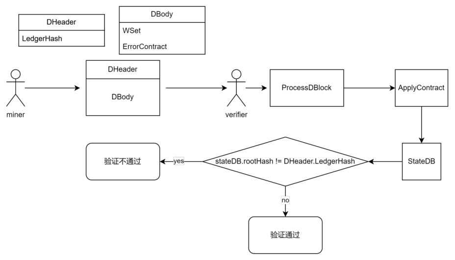
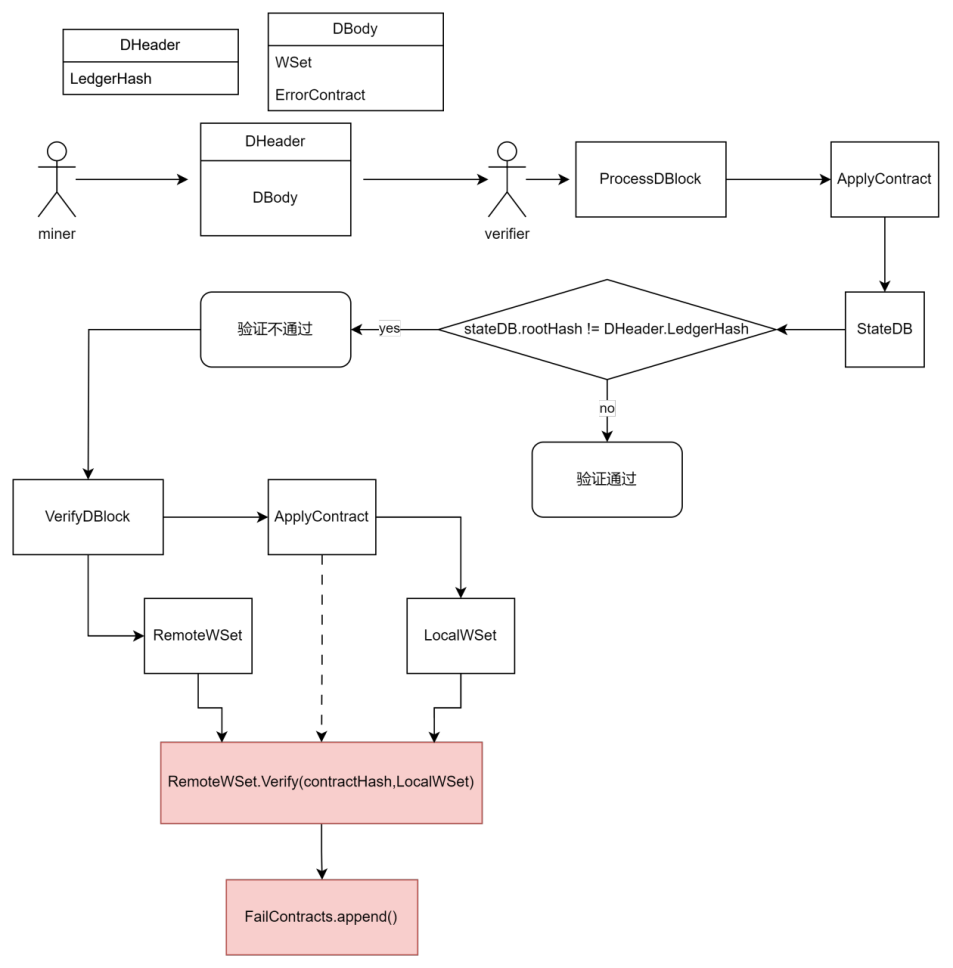
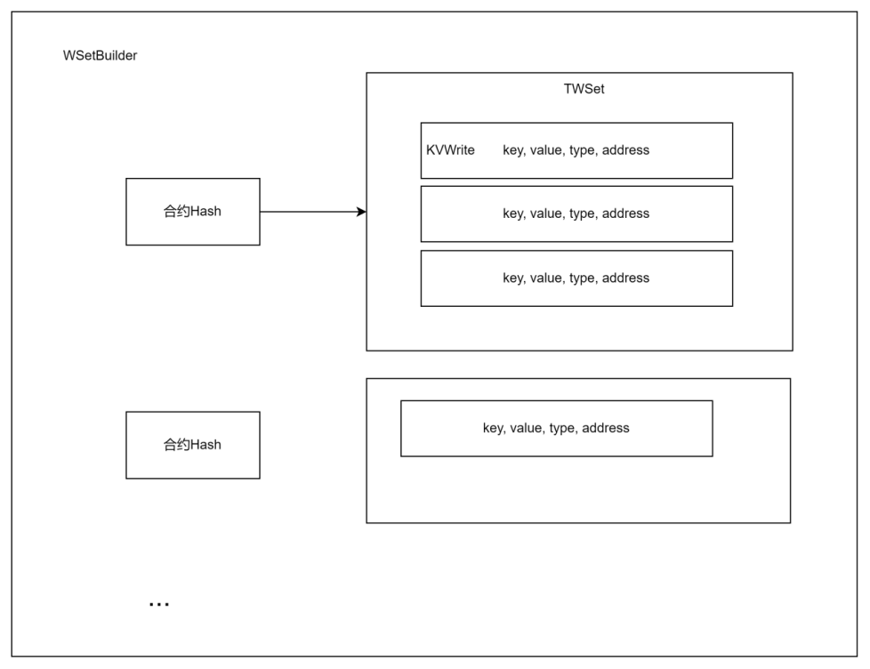

# 晶格链区块与合约验证

## 1.合约验证目的

晶格链支持多语言智能合约，但对这类智能合约的逻辑约束力不强，如过在合约中存在下面情况的逻辑就会导致账本不一致

> 1. 合约的执行结果因节点而异。不同节点执行合约后产生的结果不一样
> 2. 合约的执行结果因时而异。
> 3. 合约执行结果随机。

## 2.如何验证合约

### 2.1. 验证守护区块

上图的流程时晶格链一直使用的`守护区块验证过程` , 通过这个过程可以判断合约是否存在错误。

### 2.2 通过写集定位错误的合约

通过2.1的步骤只能对区块是否包含错误的合约做出判断，但不能确定具体是哪个合约出错了。

为每一笔多语言智能合约交易生成写集。节点通过**对比自己执行合约生成的写集与收到的写集 hash是否一致**，判断合约是否存在错误。

### 2.3  写集的结构

## 3. 如何对区块的正确性下定论

活跃性

活跃性是系统继续运行时在分布式系统环境中使用的术语。这意味着**即使出现一些错误，系统也不会停止运行**。在区块链的情况下，活跃意味着系统将继续向链中添加新的区块，并且**在任何时候系统都不会停止工作**。

安全性

当系统收敛于单个决策时，安全性是分布式系统环境中使用的术语。在分布式系统中，节点可能会分成两个决策或进一步拆分，分布式系统的安全性**确保了即使存在故障节点，网络也会在所有可靠节点上以单个决策结束**。

### 决策

miner收到f+1个签名（正确/错误）即认为区块正确/错误。

###  证明

证明：共识要保证系统的**活跃性**和**安全性**，将从这两方面证明区块验证的可行性。

假设目前使用的为BFT类共识，容错能力为3f+1=N。

节点类型分为3种正确的节点（correct), 错误的节点（fault）,未知的节点（Unreachable）。

#### 3.1 活跃性证明

保证在有f个错误节点和f个未知节点，不影响共识。

正确节点的数量为 C >= N -2f  即 C >= f+1

#### 3.2 安全性证明

不同的决策下能够决策出一致性决定。

反正法：假设存在情况Q，造成节点做出了不一致决策

> 有两个不同的决定 A 和 B，其中A认为区块正确。
>
> A: f + 1
>
> B: 2f (f>=1)

在假设只有f个fault节点时，**Q是不可能出现的**，因为如果正确的节点认为A正确，那B的签名最多有f个。

因此只需要收到f+1个**同类型**的签名即可断定该签名至少包含1个正确节点的签名, 就可以断定该区块是正确/错误的。

在**合约内容存在错误**的情况下，两个正确的节点也有可能因为合约的错误而产生不同的结论，因此是有可能出现上述情况的。此时A与B都包含了正确节点的签名，miner通过时间判断哪个决定的签名首先被收集足够，即确定该结论，**不会出现决策不一致**。

