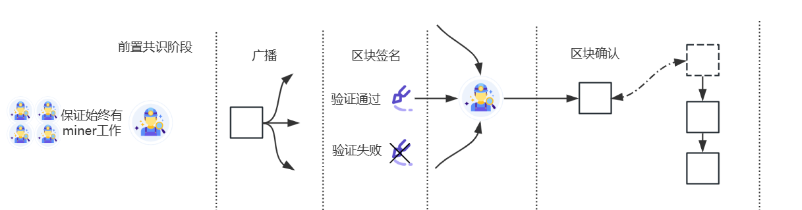

## 共识算法

共识算法即在分布式账本中，负责维护这些账本的节点如何在账本上记录一致性的数据。

在晶格链中，将共识分为了前置共识和后置共识两个阶段，前置共识负责管理共识节点的出块权，后置共识负责区块的一致性验证。

### 见证共识

见证共识晶格链自研的一个共识算法，主要流程为 1.接收区块-> 2.签名-> 3.收集签名-> 4.确认区块；

见证共识只收集一轮签名即可实现BFT容错，代价是在特定情况下会出现区块分叉（如情景1，[情景2](#fork)）。

client对分叉的产生是无感知的，在分叉过程中区块高度是不增长的，对于client来说只要区块被确认，就不会被撤销，所以见证共识即使会分叉但仍然是确定性共识。

> 情景1： leader作恶，或leader出块后掉线又重新出块。
>
> ​	环境：a,b,c,d 四个节点，a作为leader
>
> ​	a发给b块α，发给c，d块β。
>
> ​	b对α签名并广播此签名，c，d对β签名并广播
>
> ​	b收到β的签名，向c/d 请求区块β; c 收到α的签名，b请求区块α；
>
> ​	b,c,d 在同一高度产生分叉，α和β；

### 见证共识的前置共识 PoA（**Proof of Authority**）


## 共识过程

### 前置共识和后置共识是什么？
**前置共识**包括了晶格自研优化的PoA，主要是对上链数据的节点进行了循环排序设置，确保当前节点出问题，仍然有候补节点接替数据上链的工作，不会导致上链失败。**后置共识**是自研的一种基于BFT的见证共识机制，主要是让见证节点对上链的数据进行投票验证，超过三分之二个节点确认后的数据，就再也无法篡改，在链上锚定。


### 共识的流程（交易从发起到被确认的过程）

1. 用户发起一笔交易（TBlock）到peer1
2. peer1验证并广播这笔交易和签名给peer i
3. peer i 验证交易并广播签名
4. peer i 收集到大于2/3共识节点数量的签名后TBlock放入TBpool
5. 前置共识选出当前高度的DBlock的出块者 peer 2（peer2可以与peer1为同一节点）
6. peer2 在打包区块时引用已经确认的TBlock的hash, 生产DBlock1
7. peer2 在等待规定的period时间后验证并广播DBlock1
8. peer i 验证DBlock1，广播签名
9. peer i 收集到大于2/3共识节点数量的签名后，DBlock1确认，其引用（守护）的TBlock也被最终确认

下图为DBlock共识示意图，TBlock无需miner（前置共识）其余流程相同



### 分叉

#### <span id="fork">分叉的产生</span>

在step5中如果按规则选出的peer并没有按预期打包区块并广播（在p2p网络中表现为：当前节点未在△内收到当前高度的区块）, 那么当前节点会成为miner打包并广播区块，由此会产生分叉。

#### 分叉的处理

在产生分叉之后，每个节点会将先收到的区块或签名数量较多的区块作为mainBlock

```golang
if br.MainBlock == nil || len(br.MainBlock.GetSigners()) < len(wb.GetSigners()) {
    br.MainBlock = wb
}
```

在后续，会在mainBlock的基础上继续出块。

1. 如果在后续高度上仍然收到了多个区块且这些区块的签名都不大于2/3，用同样的方法在分叉上继续追加。
2. 如果在某个高度上收到某区块其签名数量大于2/3，则以该区块的引用结束分叉。