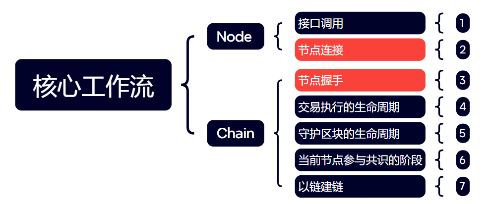

# 日志订阅
## 工作流订阅



### 工作流订阅条件

|          |                |                    |
| -------- | -------------- | ------------------ |
| logType  | 工作流类型     |                    |
| logLevel | 工作流级别     |                    |
| chainId  | 链ID           |                    |
| apiScope | 订阅的API范围  | logType != 1时无效 |
| hash     | 订阅的交易hash | logType != 4时无效 |

1.**建议订阅时按`链id`，`工作流类型`分类存储**

2.**除排查接口问题外，不建议监听接口调用的工作流**

## 推送的信息（公有）

|                  |            |                            |
| ---------------- | ---------- | -------------------------- |
| <u>chainId</u>   | 链Id       | 当工作流跟链无关时可能为空 |
| <u>flowLevel</u> | 工作流级别 | 1：一般级别，2：错误级别   |
| <u>info</u>      | 信息       | 一般级别时的信息           |
| <u>error</u>     | 错误信息   | 错误级别时的信息           |
| <u>timestamp</u> | 时间戳     |                            |


### 表1 工作流类型

|      |          |                                                              |
| ---- | -------- | ------------------------------------------------------------ |
| 1    | 接口调用 | 必须传递接口前缀[¹](#note1)，不能接受所有节点调用的工作流（没必要） |
| 2    | 节点连接 | 在订阅之前的连接工作流不会推送                               |
| 3    | 节点握手 | 在订阅之前的握手工作流不会推送                               |
| 4    | 交易执行 | 可选参数：hash，订阅指定交易的执行工作流，`短暂的`订阅，交易落块后订阅结束 |
| 5    | 守护区块 |                                                              |
| 6    | 共识阶段 |                                                              |
| 7    | 以链建链 |                                                              |

> <span id="note1"> rpc接口method方法名，如订阅wallet_相关接口，前缀为wallet\_</span>

## 短暂的订阅

订阅`交易执行`的工作流，目的是监听某笔交易的生命周期，如交易落块，即完成了监听的过程。

 此类工作流定义为`短暂的`工作流，有结束标志，在订阅的工作周期结束后，不再推送消息。

结束标志的字段为 `Phase`  它目前只有一个值 `END` ，客户端可以据此判断订阅是否已经结束。


## 订阅示例1

订阅所有工作流，`{}` 不能删除

```json
{
    "jsonrpc": "2.0",
    "method": "node_subscribe",
    "params": [
       "workflow",
        {  
        }
    ],
    "id": 481
}
```

等价于

```json
{
    "jsonrpc": "2.0",
    "method": "node_subscribe",
    "params": [
       "workflow",
        {  
            "logType": 0,
            "logLevel": 0,
            "chainID": 0,
            "apiScope": "",
            "hash": ""
        }
    ],
    "id": 481
}
```

### 订阅示例2

订阅交易`0x12`的执行过程

```json
{
    "jsonrpc": "2.0",
    "method": "node_subscribe",
    "params": [
       "workflow",
        {
            "logType": 4,
            "hash": "0x123"
        }
    ],
    "id": 481
}
```

### 订阅示例3

只订阅链123的Error工作流

```json
{
    "jsonrpc": "2.0",
    "method": "node_subscribe",
    "params": [
       "workflow",
        {
            "logLevel": 2,
            "chainID": "123"
        }
    ],
    "id": 481
}
```

## 1.接口调用

| ...    | ...        | ...                                              |
| ------ | ---------- | ------------------------------------------------ |
| method | 接口方法   |                                                  |
| params | 接口参数   |                                                  |
| return | 接口返回值 | 与公有的info不同是return在整个流程成功后才会返回 |

订阅”latc_getCurrentDBlock“

```json
{
    "jsonrpc": "2.0",
    "method": "node_subscribe",
    "params": [
       "workflow",
        {
            "logType": 1,
            "apiScope": "latc_getCurrentDBlock",
            "chainId": xxx
        }
    ],
    "id": 481
}
```

正常流程：

- serverd

- return

## 2.节点连接

|           |                         |      |
| --------- | ----------------------- | ---- |
| iNodeInfo | 连接节点的信息/节点hash |      |

订阅：
```
{
    "jsonrpc": "2.0",
    "method": "node_subscribe",
    "params": [
       "workflow",
        {
            "logType": 2
        }
    ],
    "id": 481
}
```

### 参考流程

#### 2.1 节点的连接流程

- listen peer connected
- network coneect
- handle new peer success

#### 2.2 节点断开流程

- listen peer disconnected
- network disconnected
- peer removed

## 3.节点握手

|        |          |      |
| ------ | -------- | ---- |
| peerId | 节点信息 |      |

```
{
    "jsonrpc": "2.0",
    "method": "node_subscribe",
    "params": [
       "workflow",
        {
            "logType": 3
        }
    ],
    "id": 481
}
```

### 参考流程：

- rec confirm handshake
- handle new peer
- receive handshake, reply handshake
- initiate handshake
- send handshake message to this pid
- handshake success
- peer manager register success
- hardSyncer register peer success

## 4.TBlock

|        |              |      |
| ------ | ------------ | ---- |
| hash   | 交易区块hash |      |
| height | 交易区块高度 |      |

```json
{
    "jsonrpc": "2.0",
    "method": "node_subscribe",
    "params": [
       "workflow",
        {
            "logType": 4,
            "chainId": 120
        }
    ],
    "id": 481
}
```

参考流程：

- AddLocalWitnessTBlocks

- addLocalWitnessTBlocks

- addLocalWitnessTBlocks: broadcastWTBlock

- addWitnessTBlock

- handle witnessing signature, from

- CommitTBlock

- commitBlock

- sign witness block

- add sig

- broadcast signature

- witness commit signature

- add sig

- block sig enough

- confirm block

- Accountant write a transaction block to chain

- transaction block has quoted on daemon block, dbNumber: %s, dbHash: %s


## 5.DBlock

|        |              |      |
| ------ | ------------ | ---- |
| hash   | 守护区块hash |      |
| height | 守护区块高度 |      |

订阅：

```json
{
    "jsonrpc": "2.0",
    "method": "node_subscribe",
    "params": [
       "workflow",
        {
            "logType": 5,
            "chainId": 120
        }
    ],
    "id": 481
}
```

- new dblock has been mined
- Reach delay time, delay: 979.329526ms
- sign witness block
- add sig
- broadcast signature
- handle witnessing signature, from:xxx
- witness commit signature
- add sig
- block sig enough
- confirm block
- block finalize
- write dblock start
- Accountant write a daemon block to chain

## 6. Consensus

订阅：

```json
{
    "jsonrpc": "2.0",
    "method": "node_subscribe",
    "params": [
       "workflow",
        {
            "logType": 6,
            "chainId": 120
        }
    ],
    "id": 481
}
```

参考流程PoA：

- Miner receive db num
- commitNewWork
- commitNewWork parentDB hash:0x7c743b90391372153c204c803468c65d9b3481e376ad7a82e7f48d32ddda7526, parentNumber: 67294
- Chains120 successfully sealed new daemon block, number: 67295, hash: 0x08ee73deb095e3c2ca5781d56dcd2d7a38436b774a897ce534cd68b09420f6f3, elapsed: 1.408m
- committing end

## 7.ChainByChain

|                  |                                        |      |
| ---------------- | -------------------------------------- | ---- |
| childChainId     | 正在创建或连接的链的id                 |      |
| chainByChainType | 以链建链的操作类型：新建链，停止链 ... |      |

订阅：

```
{
    "jsonrpc": "2.0",
    "method": "node_subscribe",
    "params": [
       "workflow",
        {
            "logType": 6,
            "chainId": 120
        }
    ],
    "id": 481
}
```

以链建链的情况和流程较多。
