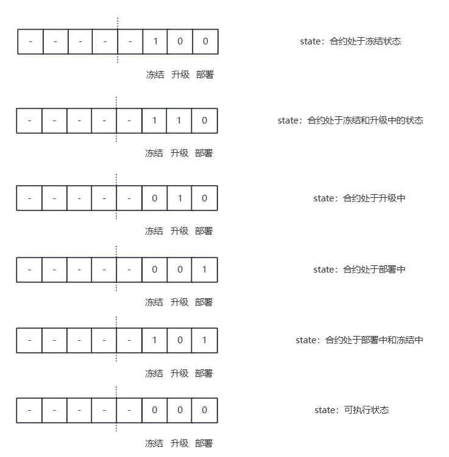
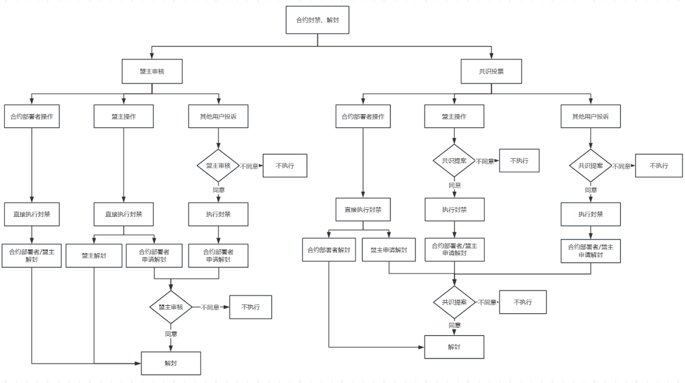
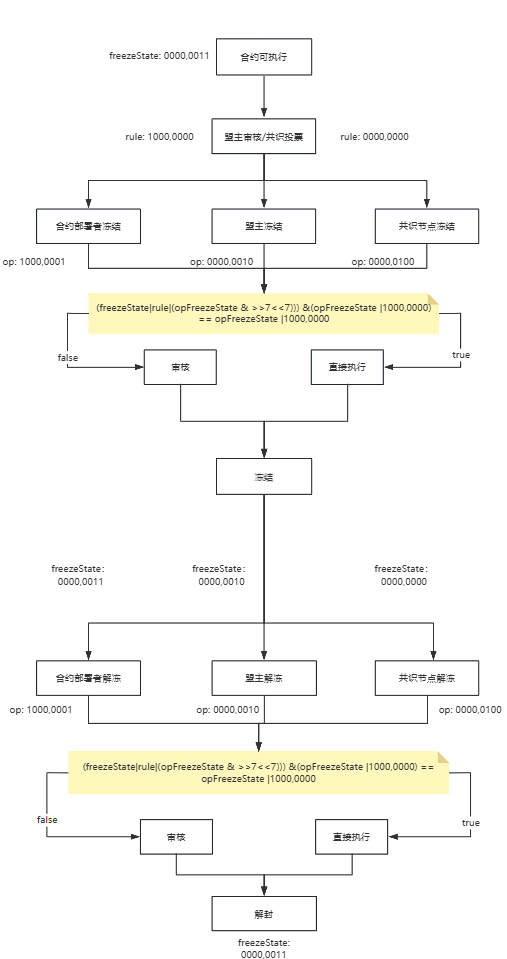

# 合约生命周期管理位

合约生命周期的状态以及冻结解冻信息通过两个字节表示： ```type ContractManagerBits [2]byte```


- contractManagerBits[0]: 合约状态，以下简称state
- contractManagerBits[1]: 合约冻结解冻是否需要投票的控制位（具体控制行为见合约冻结和解冻），以下简称freezeState

合约状态有以下几种以及其对应的状态码

>opCode：发起提案时ContractManagerBits的值，
>
>state：合约信息中ContractManagerBits[0] 的值
>
>freezeState: 合约信息中ContractManagerBits[1] 的值
>
>



合约生命周期状态图：


## 合约生命周期：升级和部署

合约的升级和部署由配置项`contractLifecycleRule` (以下简称lcRule)控制，lcRule的值以及对应的部署升级是否需要投票如下表

| contractLifecycleRule | 部署             | 升级             |
| --------------------- | ---------------- | ---------------- |
| 0                     | 不需要投票       | 不需要投票       |
| 1                     | 需要盟主投票     | 需要盟主投票     |
| 2                     | 需要共识节点投票 | 需要共识节点投票 |

合约的不同状态对应的state值

| 合约状态    | byte      |
| ----------- | --------- |
| 部署中      | 0000,0001 |
| 部署&冻结中 | 0000,0101 |
| 升级中      | 0000,0010 |
| 升级&冻结中 | 0000,0110 |
| 冻结中      | 0000,0100 |
| 运行中      | 0000,0000 |

不同的提案对应的opstate值

| 提案         | byte      |
| ------------ | --------- |
| 部署合约提案 | 0000,0001 |
| 升级合约提案 | 0000,0010 |
| 冻结合约提案 | 0000,0100 |
| 解冻合约提案 | 0000,0100 |

**opstate** ^ **state** -> **新的state**

eg.

部署合约提案通过：0000,0001 ^ 0000,0001 = 0000,0000  合约变为运行中


## 合约生命周期：冻结和解冻

合约冻结解冻的投票逻辑较为复杂，下图为产品流程图：



### 如何通过freezeState控制投票逻辑：

不同提案对应的冻结控制位opFreezeState

|      | 发起者     |           |
| ---- | ---------- | --------- |
| 部署 | 任意       | 0000,0000 |
| 升级 | 任意       | 0000,0000 |
| 冻结 | 合约部署者 | 1000,0001 |
| 解冻 | 合约部署者 | 1000,0001 |
| 冻结 | 盟主       | 0000,0010 |
| 解冻 | 盟主       | 0000,0010 |
| 冻结 | 共识节点   | 0000,0100 |
| 解冻 | 共识节点   | 0000,0100 |

与合约状态state组合后的 opCode：

|      | 发起者     |                       |
| ---- | ---------- | --------------------- |
| 部署 | 任意       | [0000,0001 0000,0000] |
| 升级 | 任意       | [0000,0010 0000,0000] |
| 冻结 | 合约部署者 | [0000,0100 1000,0001] |
| 解冻 | 合约部署者 | [0000,0100 1000,0001] |
| 冻结 | 盟主       | [0000,0100 0000,0010] |
| 解冻 | 盟主       | [0000,0100 0000,0010] |
| 冻结 | 共识节点   | [0000,0100 0000,0100] |
| 解冻 | 共识节点   | [0000,0100 0000,0100] |


部署和升级投票规则与发起者无关，下面详细介绍一下冻结解冻的是如何通过byte判断是否需要投票的：

freezeState&opFreezeState=opFreezeState 可以验证发起者的身份是否可以无需投票；①

同时需要满足rule位也为1，这是为了适配合约冻结规则，如在盟主审核的规则下，盟主发起冻结才不需要投票

freezeState&(opFreezeState | 10000000)=opFreezeState  | 10000000 ②

合约冻结规则受三个方面影响：1. 配置项 2. 合约部署者发起时都不需要投票。

因此 freezeState = freezeState|rule|(opFreezeState >>7<<7) ③

根据②与③得：

(freezeState|rule|(opFreezeState & >>7<<7))) &(opFreezeState |1000,0000) == opFreezeState |1000,0000 ④

### 不同发起者发起冻结的opFreezeState以及冻结前的freezeState

#### 合约部署者

根据原型流程图知，合约部署者发起的冻结不受配置影响，均不需要投票得到：

opFreezeState: 1000,0001

freezeState: 0000,_ _ _1

#### 盟主

盟主发起冻结是否需要投票有配置项决定因此

opFreezeState: 1000,0001

freezeState: 0000,_ _11

#### 共识节点

共识节点发起冻结均需要投票，根据规则①可以在freezeState的共识节点位始终置为0实现；

由此可得

opFreezeState：0000,0100 ； 

freezeState: 0000,0011

### 不同发起者发起解冻的opFreezeState以及解冻前的freezeState

opFreezeState 与冻结一致，freezeState 控制是否需要投票。

0000,0011: 合约部署者冻结的合约

0000,0010：盟主冻结的合约

0000,0000：共识节点冻结的合约

#### 结论


