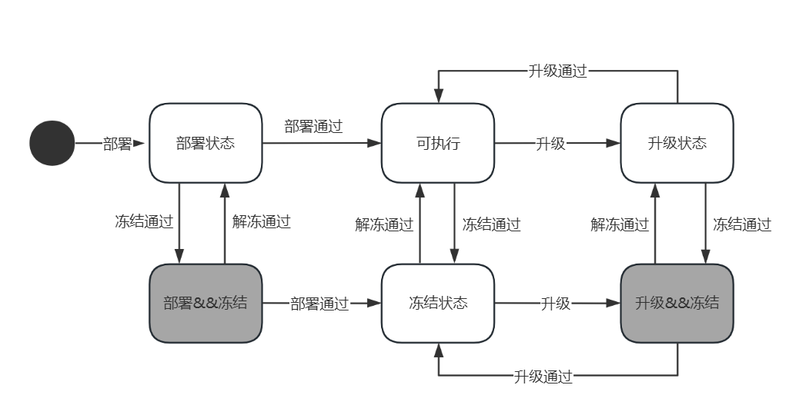

## 1.需求分析

baas新需求，要求合约生命周期做相关适配。

需求如下：

1. 合约生命周期始终开启

2. 合约部署和升级使用统一的配置

3. 合约冻结和解冻的投票规则变动为

   1.  冻结
      1. 合约部署者冻结合约无需投票
      2. contractFreezeRule 为1 时盟主冻结合约无需投票
   2. 解冻
      1. 合约部署者解冻 被 合约部署者冻结的合约  ，无需投票
      2. contractFreezeRule 为1时 盟主解冻被合约部署者冻结的合约，无需投票
      3. contractFreezeRule 为1时 盟主解冻被盟主冻结的合约，无需投票

   其他情况下需要投票，如果与产品原型图有出入，以产品原型图为准

如有疑问可联系 @孙小龙 @齐拢

## 2. 版本信息

- 提交日期：2025年6月13日
- gitlab分支：develop-v2.2.0-clc

## 3. 提测内容

测试智能合约的生命周期管理功能，包括部署、升级、冻结和解冻等操作是否符合产品需求。
1. 合约生命周期始终开启，IsContractVote 配置被删除 

2. 是否盟主独裁的配置被细化，IsDictatorship 配置被删除，现盟主独裁的配置由其他配置管理。 

3. 合约部署规则DeployRule删除，合约部署与升级改为统一配置 contractLifecycleRule 

   - contractLifecycleRule可选项0,1,2分别对应不需要投票，盟主投票，共识节点投票

4. 新增合约冻结和解冻的投票规则 contractFreezeRule 

   - contractFreezeRule 可选项 1 和 非1 分别对应盟主独裁和共识节点投票。

5. 新增合约冻结和解冻在以下情况时无需投票

   -  冻结
      1. 合约部署者冻结合约无需投票
      2. contractFreezeRule 为1 时盟主冻结合约无需投票
   - 解冻
      1. 合约部署者解冻 被 合约部署者冻结的合约  ，无需投票
      2. contractFreezeRule 为1时 盟主解冻被合约部署者冻结的合约，无需投票
      3. contractFreezeRule 为1时 盟主解冻被盟主冻结的合约，无需投票

   其他情况下需要投票，如果与产品原型图有出入，以产品原型图为准

6. 新增配置修改提案

   - 新增修改contractLifecycleRule的提案， 获取[修改合约生命周期规则code的api](http://172.22.0.23:5173/docs/source/api/proposal#wallet-getchangecontractlifecyclerule)
   - 新增修改contractFreezeRule的提案， 获取[修改合约冻结规则code的api](http://172.22.0.23:5173/docs/source/api/proposal#wallet-getchangecontractfreezerule)

7. 修改合约生命周期提案的合约冻结、解冻

   - 修改后的获取code的api：获取合约[冻结](http://172.22.0.23:5173/docs/source/api/contract#wallet-getfreezecode)/[解冻](http://172.22.0.23:5173/docs/source/api/contract#wallet-getunfreezecode)code的api，旧的获取冻结/解冻/吊销code的api被删除
   - 修改后的合约生命周期提案预置[合约abi](http://172.22.0.23:5173/docs/source/contract/precompile/contractsTable#contractlifecycleproposal)

   

8. 合约状态变更限制调整，不同合约状态可以同时存在，新的状态图如下：

   

9. 接口变化：

   1. 新增的接口
      - 修改contractLifecycleRule的提案， 获取[修改合约生命周期规则code的api](http://172.22.0.23:5173/docs/source/api/proposal#wallet-getchangecontractlifecyclerule)
      - 修改contractFreezeRule的提案， 获取[修改合约冻结规则code的api](http://172.22.0.23:5173/docs/source/api/proposal#wallet-getchangecontractfreezerule)
      - 获取合约[冻结](http://172.22.0.23:5173/docs/source/api/contract#wallet-getfreezecode)code的api
      - 获取合约[解冻](http://172.22.0.23:5173/docs/source/api/contract#wallet-getunfreezecode)code的api
   2. 删除的接口
      - 修改deployRule的相关接口
      - 修改isDictatorship的相关接口
      - 修改isContractVote的相关接口
      - 合约生命周期v1,v2 版中 获取冻结/解冻/吊销code 的接口分别为 wallet_generateSuspendCode 和 wallet_getNewSuspendCode

## 4. 自测内容

安装需求分析的内容进行了如下测试：

```python
def testMain():
    # 合约生命周期的不同规则
    for contractLifeCycleRule in [0,1,2]:
        # 合约冻结的不同规则
        for contractFreezeRule in [0,1]:
            # 不同的合约部署者
            for deployCaller in callers:
                # 不同的合约升级者
                for upgradeCaller in callers:
                    # 不同的冻结着
                    for deployCaller in callers:
                        # 不同的解冻者
                        for upgradeCaller in callers:
```

测试结果均符合预期

## 5. 影响范围

智能合约生命周期管理的不同版本之间并不能相互兼容，以下情况会导致网络或账本故障

- 在已有旧账本数据的网络中更新节点，如果之间网络中出现旧区块的同步，会出现账本MPT树不一致；

**不能有此版本之前的历史数据**

## 附件/在线文档：

1. [自测脚本](https://gitlab.zlattice.top/Tom_Zhou/zlattice/-/tree/develop-v2.2.0-clc/test/zvm/proposal_contract_lifecycle)
2. [合约生命周期v3的详细设计](http://172.22.0.23:5173/docs/design/contractLC/detail)
3. 合约生命周期v3的相关api
   1. 获取[冻结](http://172.22.0.23:5173/docs/source/api/contract#wallet-getfreezecode)/[解冻](http://172.22.0.23:5173/docs/source/api/contract#wallet-getunfreezecode)code的api：
   2. 获取[修改合约生命周期规则](http://172.22.0.23:5173/docs/source/api/proposal#wallet-getchangecontractlifecyclerule)、[修改合约冻结规则](http://172.22.0.23:5173/docs/source/api/proposal#wallet-getchangecontractfreezerule)code的api