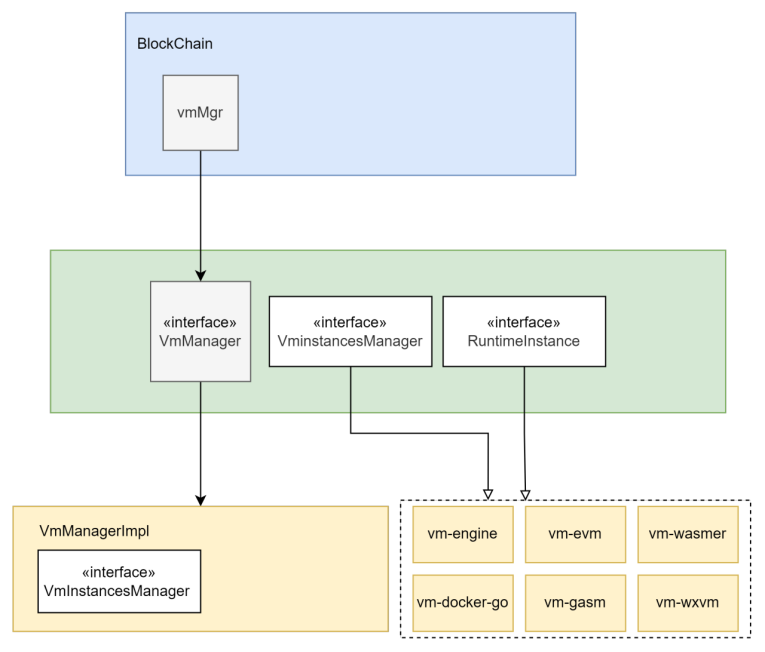
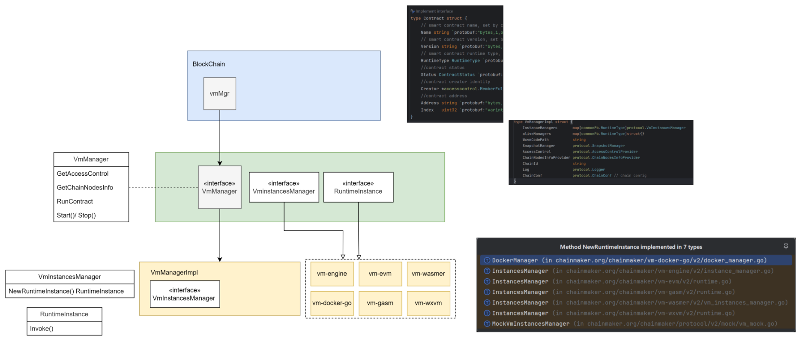
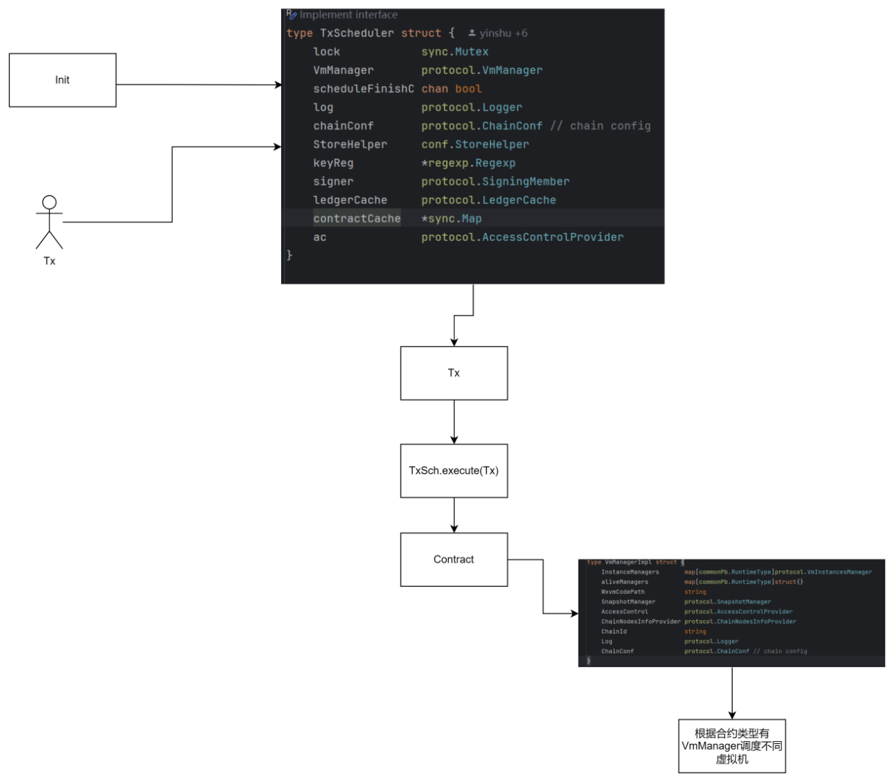
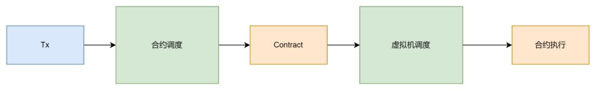
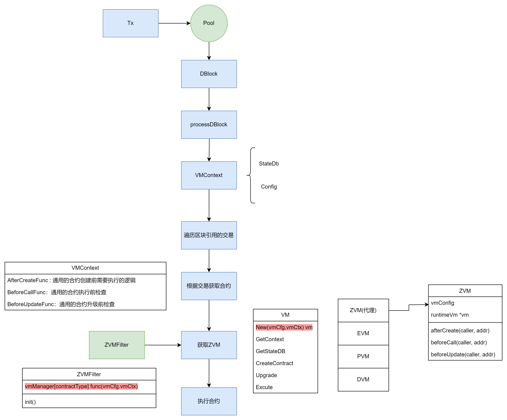
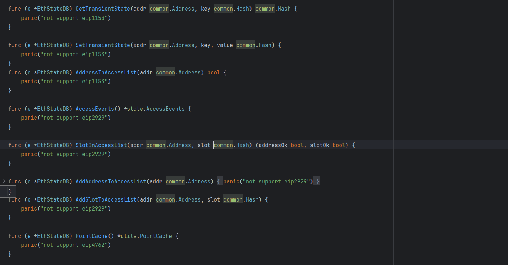
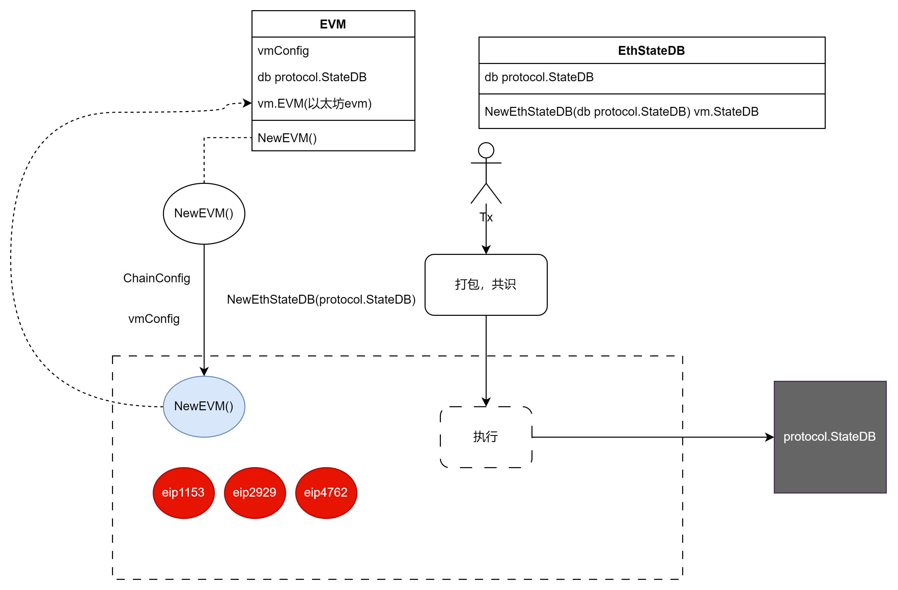

# 1.一阶段重构

## 1.1 需求分析

### 1.1.1 需求说明

目前晶格链中存在对三种不同类型的合约：

- 预编译合约
- solidity合约
- 其他语言合约（golang, java等）

晶格链虚拟机（ZLattice Virtual Machine）对这三种不同合约（尤其是第二和第三种）的逻辑处理偏向面向过程开发的①。不利于维护和扩展。需要将其改写为面向对象的架构。

> 注①：面向过程关注业务每一步要做什么，随着业务复杂度提升，代码会变得冗长难以理解；面向对象关注业务中每一个对象，由对象建的交互完成一件事务，职能划分更细致，随着业务复杂度的提升，代码复杂度趋于稳定。

### 1.1.2 需求调研

参考目前市面上的其他区块链项目，chainmaker 中的智能合约体系与晶格链最为相似。

#### chainmaker的技术实现

chainmaker 的虚拟机层次结构大致如下

- BlockChain :  链层，负责交易接受和区块打包等操作
- VmManager: 虚拟机管理层：定义了虚拟机的实现协议
- Impl: 虚拟机管理器实现和不同类型的虚拟机的实现

其中的属性和方法如下：

chainmaker合约调用总体流程：

#### 晶格链zvm重构总体思路

##  1.2总体设计

流程图如下

- VMContext：虚拟机上下文，与合约交易 1:1的关系，其中包括合约执行的必要参数，以及callback函数。
- ZVMFilter：根据tx实例化不同的虚拟机
- ZVM：代理各种不同的实现，实现一些callback函数对合约做统一处理：如创建合约时对合约管理列表初始化。
- EVM，PVM，DVM：Solidity合约，预编译合约，其他语言合约对应的虚拟机

# 2.二阶段重构

## 2.1需求分析

### 问题描述

以太坊智能合约更新频繁，如果增加opCode，用户在使用最新的编译器编译后的solidity合约字节码无法在晶格链上正常部署和调用。

### 当前阶段方案

在皖文创链项目中就遇到了这个问题，解决方案是增加缺少的操作码。

### 改进方案

这种升级方法工作量较大，且每次升级时需要考虑其他所有opCode的变化情况，增加了测试成本。

通过直接使用ethereum作为第三方库，直接使用其evm模块。

### 功能需求

1. evm的升级后只需要对go-ethereum进行合并处理即可。
2. 保证使用以太坊官方编译器的最新版本编译出的合约字节码可以正常部署调用。（如有不支持语法能够明确说明）

### 实现策略

#### 以太坊eip协议升级分析

以太坊的evm中有许多通过时间戳和区块高度判断`升级`的逻辑。

针对每次升级涉及的内容需要做整理分析，梳理出每次升级的判断是否符合晶格链的要求，如：上海升级中涉及了非常多的eip协议，我们需要考虑其中涉及到evm的升级是否能够复用到晶格链。

经过分析有以下几个协议的升级不能复用到晶格链

eip1153, eip2929, eip4762

**eip1153:**  坎昆升级，加入临时存储，减少在合约中访问修改临时变量的手续费

**eip2929:**  柏林升级，通过增加首次访问一下地址的gas成本低于DOS攻击

**eip4762:**  以太坊代码中已经有了实现，但还没有投入使用。

除此之外的协议，在evm都应该能够使用

#### 策略描述

以太坊的升级判断中是一次升级实现多个eip协议。如eip1153和eip3855都是上海升级的内容。但只需要eip3855。考虑到找到不支持的协议比找需要增加的协议复杂度要高。在go-ethereum中对上述三个协议增加额外的判断，实现和理解起来都比较简单。

## 2.2总体设计

## 晶格链上的改动

