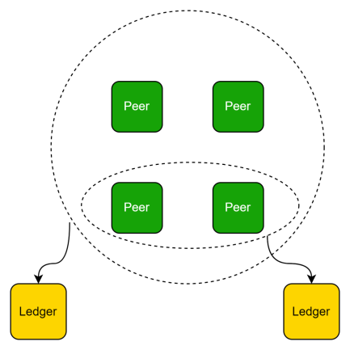
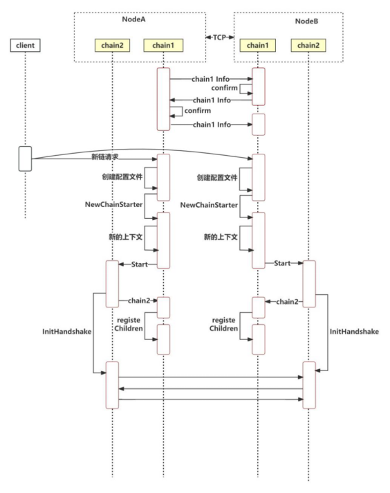
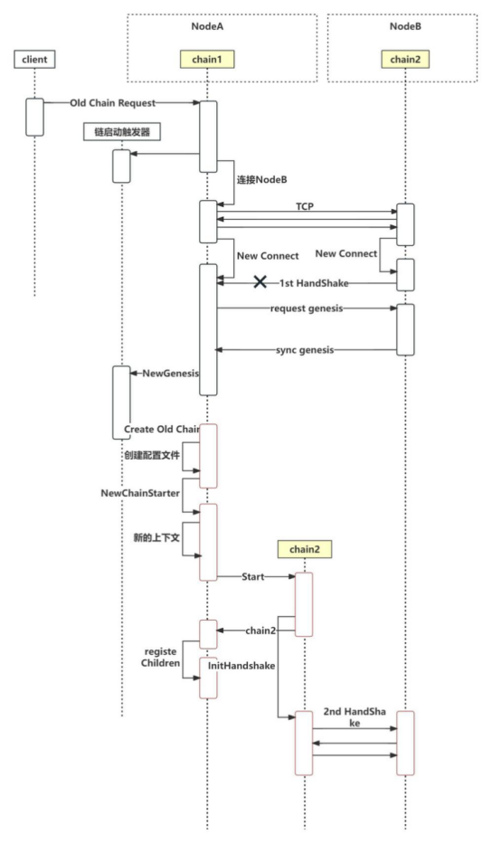
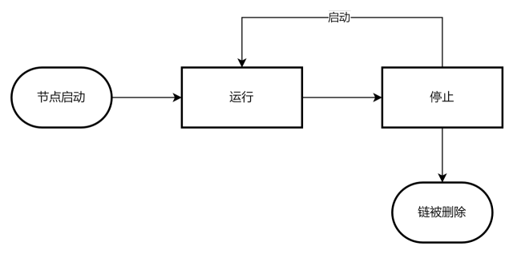

# 什么是以链建链？

如果你正在运行一条2.0版本以上的晶格区块链，现有业务产生的数据较多，但与主体业务无关，或需要与其他业务数据隔离。那么你就可以通过**以链建链**新建一个账本来为这类业务提供区块链支持。



# 功能介绍

## 使用说明

通过[以链建链合约ABI](/source/contract/precompile/contractsTable#chainbychainproposal)向你运行的晶格链发起相关交易

以链建链合约提供的服务以及参数说明

|        | ABI        |      |
| ------ | ---------- | ---- |
| 新建链 | newChain   |      |
| 加入链 | oldChain   |      |
| 停止链 | stopChain  |      |
| 启动链 | startChain |      |
| 删除链 | delChain   |      |


## 新建链

发起新建链时的参数如下：

| 参数名               | 类型       | 备注                                            |         |                          | 默认值                  |
| -------------------- | ---------- | ----------------------------------------------- | ------- | ------------------------ | ----------------------- |
| consensus            | uint8      | 0:继承主链1: poa 2:pbft 3:raft 默认             |         | >0                       | 继承主链                |
| tokenless            | bool       | 是否有币                                        |         |                          | 继承主链                |
| godAmount            | uint256    | 盟主初始余额                                    |         |                          | 继承主链                |
| period               | uint64     | 出块间隔，单位：ms                              |         |                          | 继承主链                |
| noEmptyAnchor        | bool       | 不允许快速出空块                                |         |                          | 继承主链                |
| emptyAnchorPeriodMul | uint64     | 空块等待次数                                    |         |                          | 继承主链                |
| isContractVote       | bool       | 开启生命周期                                    |         |                          | 继承主链                |
| isDictatorship       | bool       | 开启盟主独裁                                    |         |                          | 继承主链                |
| deployRule           | uint8      | 合约部署规则                                    |         |                          | 继承主链                |
| name                 | string     | 链名称                                          |         |                          | 主链name\_child\_子链id |
| chainId              | uint256    | 链Id                                            |         |                          | 1000->10001             |
| chainMemberGroup     | Member     | []chainMemberGroup                              | Address | 节点地址                 | 必填                    |
|                      | MemberType |                                                 | uint8   | 0: 见证1：共识           |                         |
| preacher             | Address    | 创世节点地址,不做特殊指定时preacher也是共识节点 |         |                          | 必填                    |
| bootStrap            | string     | 创世节点Inode                                   |         |                          | 不可为空                |
| contractPermission   | bool       | 合约内部管理开关                                |         |                          | 继承主链                |
| chainByChainVote     | uint8      | 以链建链投票开关                                |         |                          | 继承主链                |
| proposalExpireTime   | uint       | 提案过期时间（天）                              |         |                          | 继承主链                |
| desc                 | string     | 链描述                                          |         |                          | 空                      |
| configModifyRule     | uint8      | 链配置更改规则                                  |         | 1: 盟主独裁；2：共识投票 | 继承主链                |

 新建链时如果开启了投票，且建链参数`chainMemberGroup`包含了共识节点和见证节点，则会生成两份提案，提案1是建链的提案，在投票通过后会建立子链，`提案2`是加入链的提案，允许在`chainMemberGroup`中的见证节点投票，每投一票其对应的节点就会加入到子链中。

新建链的提案内容如下。其中字段与晶格链genesis.json文件的字段内容与含义一致。

其中需要特别注意的字段有 `consensus` `joinProposalId`

consensus: 该字段为0时，表示建链（通道/子链/分区）时未传递的参数继承主链。

joinProposalId：加入链的提案id，即上述`提案2`

```json
{
    "jsonRpc": "2.0",
    "id": 481,
    "result": {
        "proposalContent": {
            "proposalId": "0x040000000070726f706f73616c5f616464726573731d000000000000003230323430383039",
            "proposalState": 2,
            "nonce": 29,
            "launcher": "zltc_g2L1GFdBZW6wHRBs1uZNDWeHjvMErzwri",
            "createAt": 1723195724,
            "modifiedAt": 1723195724,
            "txHash": "0xf36ef8dd9dd166df5fdca83c68ad471189219be1a646bf4e921bdf3e96e2d40b",
            "dbNumber": 2,
            "ChainByChainType": "newChain",
            "ChainConfig": {
                "newChain": {
                    "consensus": 0, 该字段为0表示继承主链
                    "tokenless": true,
                    "godAmount": 0,
                    "period": 1000,
                    "noEmptyAnchor": true,
                    "emptyAnchorPeriodMul": 5,
                    "isContractVote": true,
                    "isDictatorship": true,
                    "deployRule": 1,
                    "name": "aaa",
                    "chainId": 90,
                    "preacher": "zltc_g2L1GFdBZW6wHRBs1uZNDWeHjvMErzwri",
                    "bootStrap": "/ip4/192.168.31.26/tcp/6002/p2p/16Uiu2HAm7x3KRbDVSFsBtwH8u7X3KUpQQNvWJUqhrV1kJVnWoSdx",
                    "chainMemberGroup": [
                        {
                            "member": "zltc_g2L1GFdBZW6wHRBs1uZNDWeHjvMErzwri",
                            "memberType": 1
                        },
                        {
                            "member": "zltc_Xmk6g2Lgxitrx4xEPUZgF4hHdnHwDcBuU",
                            "memberType": 0
                        }
                    ],
                    "extra": null,
                    "contractPermission": true,
                    "proposalExpireTime": 3,
                    "desc": "一个测试的分区"
                },
                "consensus": "",
                "timestamp": 1723195724,
                "parentHash": "0xfc2ac37832784c6a25730334e10e23b515ea44ec938f86df985f04f5f49b7e82",
                "joinProposalId": "0x040000000070726f706f73616c5f6164647265737309000000000000003230323430383039"
            }
        },
        "proposalResult": {
            "agreeCollection": [],
            "againstCollection": []
        }
    }
}
```


建链的时序图（如果有投票，这个过程在投票通过后才出发）：



## 加入链

加入链的参数说明

| 参数名        | 类型      | 备注                           |
| ------------- | --------- | ------------------------------ |
| chainId       | uint      | 需要加入的链ID                 |
| networkId     | uint      | 需要假如的链所在的网络ID       |
| nodeInfo      | string    | 指定一个已经加入该链的节点地址 |
| accessMembers | []address | 指定哪些节点加入该链           |

加入其他链的时序图：



## 停止链

停止的链不能是 `$ConfigsDir`/genesis.json的链

停止链的交易可以发给任意一个正在运行的链 `cbyc_chainStatus`=start

链成功停止后，不会在继续出块，不能再对链做任何写入操作，只能做读取操作。

## 启动链

重新启动已经停止的链。

## 删除链

删除已经停止的链，对正在运行的链发起删除的操作不会执行。

## 链的生命周期



