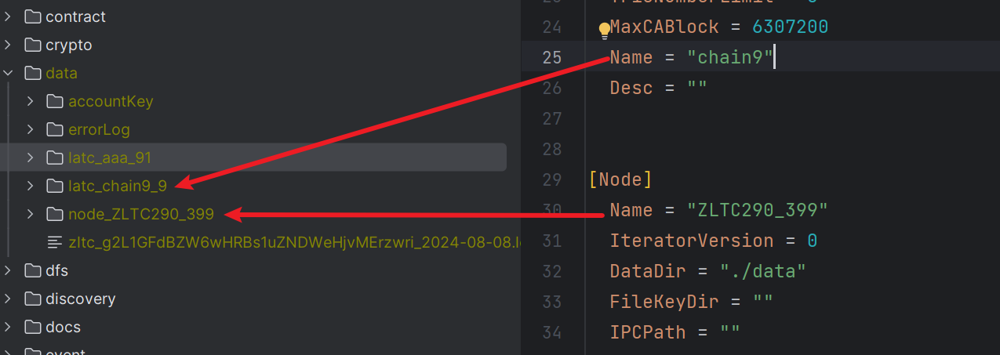

# 1. 关于提案

## 提案的公共字段

```json
{
    "proposalId": 提案id,
    "proposalState": 提案状态,
    "nonce": nonce,
    "receipt": 提案回执，提案执行错误时会返回错误信息，
    "launcher": 发起者地址,
    "createAt": 提案创建时间戳,
    "modifiedAt": 提案修改时间戳,
    "txHash": 交易hash,
    "dbNumber": 提案结束时的守护区块高度,
}
```

## 提案会过期

1. 在genesis.json中的proposalExpireTime中配置提案过期时间，大于等于1，默认为7天。

2. 在发起的提案过了一定时间后，在下次操作该提案时就会提示提案已过期。

## 针对提案的每次投票会生成一笔投票记录

1. 投票详情如[附件1](#voteDetail)；

2. voteId包含的信息有：投票对应的提案类型，投票者地址，nonce，投票内容，投票时间

## 提案Id和投票Id的生成规则

 proposalId生成规则：

 

 voteId生成规则：

 

# 2. 合约内部管理

## 合约地址：

> base58: zltc_ZDdPo8P72X7dtMNTxBeKU8pT7bDXb7NtV 
>
> hex: 0x6167655f70726f706F73616C5F61646472657373
>
> abi: 合约abi见 [预编译合约地址列表](/source/contract/precompile/contractsTable#contractinnermanagerproposal) 

## 配置文件

```json
{
  "config": {
	...
    "contractPermission": true,
 	...
  },
  ...
}
```

contractPermission： true 开启调用合约时的权限检查， false关闭调用合约时的权限检查


## 2.1 发起提案

参数说明

| 参数名          | 类型    | 含义                                                         |
| --------------- | ------- | ------------------------------------------------------------ |
| contractAddress | Address | 合约地址                                                     |
| operation       | String  | 提案要做的操作                                               |
|                 |         | {C/R/U/R}{W/B/M/T/P}{contractAddress/Threshold/mode[0,1]}[1-10], 没有空格 |
|                 |         | CWzltc_TbMJndAHmi4Z8WDnCEQX2uPzNctNFqPJd   向白名单中加入zltc... |

1. 通过[获取发起合约内部管理决策的Code接口](/source/api/proposal#wallet-getcontractinnermanagercode)获取发起提案的code，用该code发送TBlock
2. 得到返回值：提案ID

返回值：

|             |        |      |
| ----------- | ------ | ---- |
| contractRet | 提案id |      |

```json
{
    "contractAddress": "zltc_ZDdPo8P72X7dtMNTxBeKU8pT7bDXb7NtV",
    "contractRet": "0x4a7eaf5744e4a6646349c4aa29407a83e67955f1a84197979a743c3cb0c96bf8", 
    "dblockHash": "0x42703aa54bdb30b450c2c4b5352686990017a76e4173e2397be0d0f389fbd7fa",
    "dblockNumber": 24897,
    "jouleUsed": 0,
    "receiptIndex": 0,
    "success": true,
    "tblockHash": "0x89f66db65a3349d9fe9957f031951896ae658e69f5a473e048938195ccc9d511"
}
```

### 错误码：

| 错误码 | 错误信息                                                     |
| ------ | ------------------------------------------------------------ |
| 2550   | 提案指令有误,指令格式为 {C/U/D}{W/B/M/T/P}{contractAddress/Threshold/mode[0,1]}[1-10], 没有空格 |
| 2551   | 对象为T(阈值模式)时, 参数必须是自然数                        |
| 2552   | 对象为T(阈值模式)时, 操作只能为U                             |
| 2553   | 对象为P(权限访问策略模式)时, 参数只能0或1                    |
| 2554   | 对象为P(权限访问策略模式)时, 操作只能为U                     |
| 2555   | 解析地址错误，操作黑白或管理员名单时，参数应为为Base58编码的合约地址字符串 |
| 2556   | 操作黑白或管理员名单时，操作只能为C、D                       |
| 2557   | 操作管理员名单时，操作只能为C、U、D                          |
| 2558   | 操作管理员名单且命令为C(添加),U(更新)时,权重须为10到255之间的整数 |
| 2559   | 存在未完成的投票                                             |

# 3. 合约生命周期

## 合约地址：

> base58: zltc_ZQJjaw74CKMjqYJFMKdEDaNTDMq5QKi3T  
>
> hex: 0x636c655f70726F706f73616C5F61646472657373
>
> abi: 合约abi见 [预编译合约地址列表](/source/contract/precompile/contractsTable#contractlifecycleproposal)

## 3.1 吊销，冻结，解冻

- 发起提案

根据abi或开放的获取code的接口拿到交易code-> 根据code构造交易，填写`合约生命周期`的合约地址。

## 3.2 部署，升级

### 3.3.1 部署

部署合约成功后，会返回合约地址。**此时，合约是否可以直接调用由配置项决定，如果需要投票，则查找该合约此时对应的合约投票ID，如果不需要投票就可以直接对合约进行调用**。

- 通过`wallet_getProposal`方法传参`*zvm.ContractLifeCycleProposal`+`提案正在进行投票中`+ `合约地址`返回所有生命周期提案，找到对应的合约部署提案

  ```json
  {
      "jsonrpc": "2.0",
      "method": "wallet_getProposal",
      "params": [
          {
            "proposalId": "",
            "proposalType": "*zvm.ContractLifeCycleProposal",
            "proposalState": "提案正在进行投票中",
            "proposalAddress": "zltc_neSYLZHEhjaUc7eQk2GTNAg6VkSsRuzh1"
          }
      ],
      "id": 485
  }
  ```

- 得到ProposalId后通过通过投票合约投票，投票合约在后续说明

### 3.3.2 升级

对已经存在的合约进行升级，升级后合约地址不变，必须经过投票后，才能决定升级后的合约是否可以生效（即被调用）。

升级就是发送一个合约交易

```json
const unsignedTx = Object.assign(latest, {
    type: "update",  // 类型为update
    owner: wallet.address,
    linker: "zltc_mjWsdE2fMQ7AgpucTYXSFtFiaJoHJHPzf", // 需要升级的合约地址
    amount: 0,
    joule: 0,
    code: "升级后的合约bytecode",
  });
```

# 4. 链配置更改

## 合约地址：

> base58: zltc_ZwuhH4dudz2Md2h6NFgHc8yrFUhKy2UUZ  
>
> hex: 0x6966795f70726F706f73616c5F61646472657373
>
> abi: 合约abi见 [预编译合约地址列表](/source/contract/precompile/contractsTable#modifyconfigproposal)

## 提案详情

除提案公有的字段外，配置修改提案的额外内容为：

```json
{
    "modifyType": 0,
    "configValue": [
        "D6A=" // []byte数组的base64编码
    ]
}
```

## 支持修改的配置及其解析方法

| filed                | 介绍                 | 解析方法                            | modifyType |
| -------------------- | -------------------- | ----------------------------------- | ---------- |
| Period               | 出块间隔             | configValue[0]->hex->uint           | 0          |
| IsDictatorship       | 合约生命周期盟主独裁 | configValue\[0][0]->hex->uint->bool | 1          |
| AddLatcSaint         | 添加共识节点         | configValue\[][]->hex[]->address[]  | 2          |
| DelLatcSaint         | 删除共识节点         | configValue\[][]->hex[]->address[]  | 3          |
| *SwitchConsensus*    | 修改共识             |                                     | 4          |
| DeployRule           | 合约生命周期部署规则 | configValue\[0][0]->hex->uint       | 5          |
| NoEmptyuAnchor       | 不连续打包空块开关   | configValue\[0][0]->hex->uint->bool | 6          |
| IsContractVote       | 合约生命周期开关     | configValue\[0][0]->hex->uint->bool | 7          |
| ContractPermission   | 合约内部管理开关     | configValue\[0][0]->hex->uint->bool | 8          |
| ReplaceSaint         | 替换共识节点         | configValue\[][]->hex[]->address[]  | 9          |
| EmptyAnchorPeriodMul | 不连续打包空块的间隔 | configValue\[0][0]->hex->uint->bool | 10         |
| ProposalExpireTime   | 提案过期时间         | configValue\[0][0]->hex->uint       | 11         |
| ChainByChainVote     | 以链建链投票对则     | configValue\[0][0]->hex->uint       | 12         |
|                      |                      |                                     |            |

## 4.1 更改出块时间

changePeriod 

参数：period 正整数 出块间隔

[code接口](/source/api/proposal#wallet-getchangeperiodcode)

## 4.2 更改共识节点

"addLatcSaint", 

添加共识节点

[code接口](/source/api/proposal#wallet-getAddLatcSaintCode)

"delLatcSaint"

删除共识节点

[code接口](/source/api/proposal#wallet-getDelLatcSaintCode)

"repalceLatcSaint"

替换共识节点

[code接口](/source/api/proposal#apiGetReplaceLatcSaintCode)

**对5.3 addLatcSaint生成的提案进行投票时，除需要满足共识节点投票规则之外，还需满足加入的共识节点必须先启动后才能加入，否则会造成链失活。**

## 4.3 更改生命周期策略

更改isDictatorship

参数：  `bool`，true开启盟主一票制，false关闭盟主一票制

[code接口](/source/api/proposal#wallet-getchangeisdictatorshipcode)

更改部署规则 deployRule

参数： deployRule ，0/1/2 具体见附件1[DeployRule](/source/contract/proposal/proposal#dcDeployRule) 

[code接口](/source/api/proposal#wallet-getChangeDeployRuleCode)

## 4.4 更改无交易区块打包间隔

[code接口](/source/api/proposal#apiGetChangeNoEmptyAnchor)

NoEmptyAnchor

参数 `bool`, true关闭，false开启盟

## 4.5 开关合约生命周期

[code接口](/source/api/proposal#apiGetSwitchIdContractVote)

isContractVote

参数 `bool`, true关闭，false开启盟

## 4.6 开关合约内部管理

[code接口](/source/api/proposal#apiGetSwitchContractPermission)

contractPermission

参数 `bool`, true关闭，false开启盟

## 4.7 更改盟主节点

[code接口](/source/api/proposal#apiGetReplaceLatcSaintCode)

preacher

## 4.8 更改无交易不打包的间隔

[code接口](/source/api/proposal#wallet_getChangeEmptyAnchorPeriodMul)

EmptyAnchorPeriodMul

## 4.9 更改交易过期时间

[code接口](/source/api/proposal#wallet_getChangeProposalExpireTime)

proposalExpireTime

## 4.10 更改以链建链投票规则

[code接口](/source/api/proposal#wallet_getChangeChainByChainVote)

chainByChainVote

# 5. 提案投票

上述讲到的3-5均是发起提案的过程，任何一种提案在获取到其提案id proposalID之后就可以对其进行投票

## 合约地址：

> base58: zltc_amgWuhifLRUoZc3GSbv9wUUz6YUfTuWy5 
>
> hex: 0x726f706f73616c5F766f74655F61646472657373

## 5.2 投票

1. [获取投票code](/source/api/proposal#wallet_getVoteCode)
2. 发送TBlock完成投票

## 5.3 提案刷新

1. [获取提案刷新code](/source/api/proposal#wallet_getRefreshVote)
1. 发送TBlock刷新提案

## 5.4 提案取消

1. [获取取消提案的code](/source/api/proposal#wallet_getCancelVote)
2. 发送TBlock取消提案
3. 可以取消的提案

| 提案类型     | 是否支持 | 提案内容         |
| ------------ | -------- | ---------------- |
| 合约生命周期 | 不支持   |                  |
| 合约权限管理 | 不支持   |                  |
| 链配置更改   | 部分支持 | 更改共识节点提案 |

# 投票流程


提案种类

|                                        | 地址                                   |                      |
| -------------------------------------- | -------------------------------------- | -------------------- |
| *zvm.LaunchContractInnerManageProposal | zltc_ZDdPo8P72X7dtMNTxBeKU8pT7bDXb7NtV | 发起合约内部管理提案 |
| *zvm.LaunchContractLifecycleProposal   | zltc_ZQJjaw74CKMjqYJFMKdEDaNTDMq5QKi3T | 发起合约生命周期提案 |
| *zvm.LaunchConfigModifyProposal        | zltc_ZwuhH4dudz2Md2h6NFgHc8yrFUhKy2UUZ | 发起配置更改提案     |

投票预置合约

|                                        |              |
| -------------------------------------- | ------------ |
| zltc_amgWuhifLRUoZc3GSbv9wUUz6YUfTuWy5 | 投票合约地址 |

# 附件

## 1 字典

提案状态字典 <span id="dcProposalState"> ProposalState </span>

| key | value                  |          |
|-----|------------------------|----------|
| 0   | *None*                 | 空值       |
| 1   | *ProposalStateInit*    | 提案正在进行投票 |
| 2   | *ProposalStateSuccess* | 提案投票通过   |
| 3   | *ProposalStateFail*    | 提案投票未通过  |
| 4   | *ProposalExpired*      | 提案已过期    |
| 5   | *ProposalStateErr*     | 提案执行错误   |
| 6   | *ProposalCancel*       | 提案已取消    |

提案类型字典 <span id="dcProposalType"> ProposalType </span>

| key  | value                             |      |
| ---- | --------------------------------- | ---- |
| 0    | None                              | 空值 |
| 1    | *zvm.ContractInnerManagerProposal |      |
| 2    | *zvm.ContractLifeCycleProposal    |      |
| 3    | *zvm.ConfigModifyProposal         |      |

生命周期阶段 

 <span id="dcPeriod">**Period**</span>

| key  | value      |      |
| ---- | ---------- | ---- |
| *0*  | Deployment |      |
| *1*  | Upgrade    |      |
| *2*  | Suspend    |      |
| *3*  | Freeze     |      |
| *4*  | Release    |      |

 <span id="dcIsRevoke">**IsRevoke** </span>提案操作类型

| key  | value                | 备注     |
| ---- | -------------------- | -------- |
| 0    | *PROHIBITION*        | 禁止执行 |
| 1    | *ALLOWANCE*          | 允许执行 |
| 2    | *Unavailable*        | 冻结状态 |
| 3    | *DeploymentProposal* | 部署     |
| 4    | *UpgradeProposal*    | 升级     |

合约内部管理 <span id="dcPermissionMode">PermissionMode </span>

| key  | value           | 备注       |
| ---- | --------------- | ---------- |
| 0    | *WhiteListMode* | 白名单模式 |
| 1    | *BlackListMode* | 黑名单模式 |

链配置更改  <span id="dcModifyType">ModifyType</span>

| key  | value                      | 备注                   |
| ---- | -------------------------- | ---------------------- |
| 0    | *ChangePeriod*             | 更改出块间隔           |
| 1    | IsDictatorship             | 更改独裁               |
| 2    | AddLatcSaint               | 添加共识节点           |
| 3    | DelLatcSaint               | 删除共识节点           |
| 4    | SwitchConsensus            | 更改共识  **暂不支持** |
| 5    | SwitchDeployRule           | 更改部署规则           |
| 6    | SwitchNoEmptyAnchor        | 更改空交易时是否打包   |
| 7    | SwitchIsContractVote       | 合约生命周期开关       |
| 8    | SwitchContractPermission   | 合约内部管理开关       |
| 9    | ReplaceLatcSaint           | 替换共识节点           |
| 10   | ChangeEmptyAnchorPeriodMul | 空交易不打包的乘数     |
| 11   | ChangeProposalExpireTime   | 提案过期时间           |
| 12   | ChangeChainByChainVote     | 以链建链投票           |
| 13   | ReplacePreacher            | 更改盟主节点           |

链配置更改 <span id="dcDeployRule">DeployRule</span>

| key  | value | 备注           |
| ---- | ----- | -------------- |
| 0    | 0     | 部署不需要投票 |
| 1    | 1     | 盟主一票通过   |
| 2    | 2     | 共识投票通过   |


## 2 相关结构说明

### 2.1 <span id="dcPermissionList">**PermissionList**</span>

```json
{
        "permissionMode": 1,
        "threshold": 7,
        "blackList": [],
        "whiteList": [],
        "managerList": {
            "zltc_fnvthyf8pcXeraTpqk4GM5Sa5E7TBC8ZR": 10,
            "zltc_j8XPWoakQzGRk4NPYheNeJFAiDBgQ25W8": 10
        }
 }
```


>[PermissionMode](#dcPermissionMode)     PermissionMode       `json:"permissionMode"` 
>Threshold      uint8                    `json:"threshold"` //投票通过的阈值 大于10案权重加和，小于等于10案百分比
>BlackList      []common.Address         `json:"blackList"` //默认使用白名单模式
>WhiteList      []common.Address         `json:"whiteList"`
>ManagerList    map[common.Address]uint8 `json:"managerList"` //最小权重为10

### 2.2 <span id="dcProposalConent">ProposalConent</span>

#### 公共字段

```json
{
    "proposalId": "0x027eb68d749ce348b2be25d56cc6420000000000000000",
    "proposalState": 1,
    "nonce": 0,
    ...
    ...
}
```

>ProposalId    string        `json:"proposalId"`
>[ProposalState](#dcProposalState ) ProposalState `json:"proposalState"`
>Nonce         uint64 `json:"nonce"`

#### 合约内部管理提案

```json
{
    "proposalId": "0x027eb68d749ce348b2be25d56cc6420000000000000000",
    "proposalState": 1,
    "nonce": 0,
    "contractAddress": "",
    "operationCommandString": ""
}
```

>ContractAddress        common.Address `json:"contractAddress"`        //合约地址
>[OperationCommandString](contractInnerManCommand.md) string         `json:"operationCommandString"` //操作命令字符串 [C/R/U/D][W/B/M]AccountAddress

#### 合约生命周期提案

```json
{
    "proposalId": "0x027eb68d749ce348b2be25d56cc6420000000000000000",
    "proposalState": 1,
    "nonce": 0,
    "contractAddress": "",
    "isRevoke": 1,
    "period": Period
}
```

>ContractAddress common.Address `json:"contractAddress"` // 合约地址
>IsRevoke        [ContractState](#dcIsRevoke)  `json:"isRevoke"`        // 0:吊销 1:解冻 2:冻结
>Period          [Period](#dcPeriod)         `json:"period"`

#### 链配置更改提案

```json
{
    "proposalId": "0x027eb68d749ce348b2be25d56cc6420000000000000000",
    "proposalState": 1,
    "nonce": 0,
    "modifyType": "",
    "period": Period,
    "isDictatorship": "",
    "noEmptyAnchor": bool,
    "deployRule": 1,
    "latcSaint": []
}
```

>[ModifyType](#dcModifyType)     `json:"modifyType"` //修改类型，见
>Period         *big.Int `json:"period"`         // 出块间隔
>IsDictatorship bool     `json:"isDictatorship"` //
>NoEmptyAnchor  bool     `json:"noEmptyAnchor"`
>DeployRule uint8            `json:"deployRule"`
>LatcSaint  []common.Address `json:"latcSaint"` //需要加入或推出共识节点的地址
>Consensus  `json:"-"  //暂不支持

### 2.3 ProposalResult

```json
{
    "agreeCollection": [],
    "againstCollection": []
}
```

>AgreeCollection   []common.Address `json:"agreeCollection"`
>AgainstCollection []common.Address `json:"againstCollection"`

## 3 <span id="voteDetail"> 投票详情 </span>

| 字段           | 含义                    |
| -------------- | ----------------------- |
| voteId         | 投票id                  |
| proposalId     | 提案id                  |
| voteSuggestion | 投票内容： 1同意、0反对 |
| address        | 账户地址                |
| proposalType   | 提案类型                |
| nonce          | 随机值                  |
| createAt       | 投票时间                |

## 4 链数据目录调整

