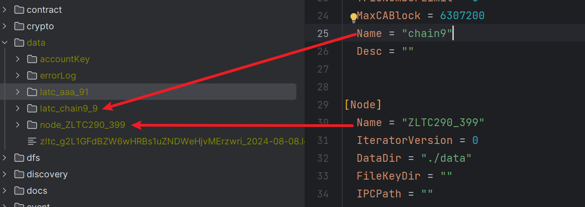

# V2.1

提案整体逻辑变动

1. 提案详情中字段增加
   1. Launcher 发起者
   2. CreateAt 创建时间
   3. ModifiedAt 修改时间
   4. TxHash 交易hash
   5. dbNumber 提案结束时的守护区块高度

   在增加上述字段后，提案共拥有

   ```json
   {
       "proposalId": 提案id,
       "proposalState": 提案状态,
       "nonce": nonce,
       "receipt": 提案回执，提案执行错误时会返回错误信息，
       "launcher": 发起者地址,
       "createAt": 提案创建时间戳,
       "modifiedAt": 提案修改时间戳,
       "txHash": 交易hash,
       "dbNumber": 提案结束时的守护区块高度,
   }
   ```
   
2. 提案会过期

   1. 在genesis.json中的proposalExpireTime中配置提案过期时间，大于等于1，默认为7天。

   2. 在发起的提案过了一定时间后，在下次操作该提案时就会提示提案已过期。

3. 增加投票详情

   1. 投票详情如[附件1](#attachVoteDetail)；

   2. voteId包含的信息有：投票对应的提案类型，投票者地址，nonce，投票内容，投票时间

    proposalId生成规则：
   
    
   
    voteId生成规则：
   
    

   3. 增加接口`wallet_getVote` & `wallet_getVoteById`。

       > wallet_getVote: 根据一定条件筛选出投票信息
       >
       > wallet_getVoteById： 根据投票Id查询投票信息
4. 查询

   1. wallet_getProposal 接口可以查询指定时间段内的所有提案

      ```json
      {
          "proposalId":  提案id，为空则按后续规则查询
          "proposalType": 提案类型，为空则返回所有类型 
          "proposalState": 提案状态，为空则返回所有状态 
          "proposalAddress": 指定地址查询特定类型的提案
        	"dateStart"：开始时间（必填项）
      	"dateEnd": 结束时间（必填项）
      }
      ```

    2. wallet_getProposalById

       原返回值：

       ```json
       {
           "proposalContent": {}, // proposal具体内容
           "proposalResult": {
              "agreeCollection": [
                  "address",
                  "address"
              ],
              "againstCollection": []
           }
       }
       ```

       变为：

       ```json
       {
           "proposalContent": {}, // proposal具体内容
           "proposalResult": {
              "agreeCollection": [
                  "voteId",
                  "voteId"
              ],
              "againstCollection": []
           }
       }
       ```

    3. wallet_getAllProposalId

       ```json
       {
         	"dateStart"：开始时间（必填项）
       	"dateEnd": 结束时间（必填项）
       }
       ```

    4. wallet_getVoteById

       ```json
       {
           "voteId":  账户地址（必填项）
       }
       ```

    5. wallet_getVote

       ```json
       {
           "owner":  账户地址（必填项）
           "suggestion": 投票建议（必填项，0：反对票 1：同意票 2：所有）
         	"dateStart"：开始时间（必填项）
       	"dateEnd": 结束时间（必填项）
       }
       ```

## 配置修改

1. 增加方法： `ChangeEmptyAnchorPeriodMul` `ChangeProposalExpireTime` `ChangeChainByChainVote` 分别对应genesis.json中的 EmptyAnchorPeriodMul，proposalExpireTime，chainByChainVote

2. 配置修改提案的详情：

   1.除提案公有的字段外，配置修改提案的额外内容为：
   
    ```json
      {
          "modifyType": 0,
          "configValue": [
              "D6A=" // []byte数组的base64编码
          ]
      }
    ```
   
3. v2.1支持修改的配置及其解析方法

   | filed                | 介绍                 | 解析方法                            | modifyType |
   | -------------------- | -------------------- | ----------------------------------- | ---------- |
   | Period               | 出块间隔             | configValue[0]->hex->uint           | 0          |
   | IsDictatorship       | 合约生命周期盟主独裁 | configValue\[0][0]->hex->uint->bool | 1          |
   | AddLatcSaint         | 添加共识节点         | configValue\[][]->hex[]->address[]  | 2          |
   | DelLatcSaint         | 删除共识节点         | configValue\[][]->hex[]->address[]  | 3          |
   | *SwitchConsensus*    | 修改共识             |                                     | 4          |
   | DeployRule           | 合约生命周期部署规则 | configValue\[0][0]->hex->uint       | 5          |
   | NoEmptyuAnchor       | 不连续打包空块开关   | configValue\[0][0]->hex->uint->bool | 6          |
   | IsContractVote       | 合约生命周期开关     | configValue\[0][0]->hex->uint->bool | 7          |
   | ContractPermission   | 合约内部管理开关     | configValue\[0][0]->hex->uint->bool | 8          |
   | ReplaceSaint         | 替换共识节点         | configValue\[][]->hex[]->address[]  | 9          |
   | EmptyAnchorPeriodMul | 不连续打包空块的间隔 | configValue\[0][0]->hex->uint->bool | 10         |
   | ProposalExpireTime   | 提案过期时间         | configValue\[0][0]->hex->uint       | 11         |
   | ChainByChainVote     | 以链建链投票对则     | configValue\[0][0]->hex->uint       | 12         |
   |                      |                      |                                     |            |
   

## 合约生命周期

查询合约状态时返回的信息更加丰富

合约状态：

```json
{
    "address": 合约地址,
    "state": 合约状态,
    "votingProposalId": 投票中的提案id,
    "deploymentAddress": 部署者地址,
    "createAt": 创建时间,
    "modifiedAt": 更新时间
}
```

## 合约内部管理

在v2.0中如删除一个不存在的管理员等操作在发起提案时不会过滤。

校验的逻辑分为对operationString格式的校验(在发起提案时)和对operationString内容的校验（提案执行时）。

在提案发起时不会校验内容，只校验格式。

v2.1中校验不区分格式校验和内容校验。在提案发起时对二者都会检查。

v2.1中合约内部管理合约 `zltc_ZDdPo8P72X7dtMNTxBeKU8pT7bDXb7NtV` 新增以下功能：

1. 批量操作

2. 初始化

   code接口：wallet_getInitContractInnerManagerCode

   ```
   {
       "jsonrpc": "2.0",
       "method": "wallet_getInitContractInnerManagerCode",
       "params": [
           {
               "contractAddress": "zltc_YsBiB4CrsFHXMmS9my5HZWswSR7jpaS6M",
               "permissionList": {
                   "permissionMode": 1,
                   "threshold": 0,
                   "blackList": [],
                   "whiteList": [],
                   "managerList": [
                       {
                           "address": "zltc_g2L1GFdBZW6wHRBs1uZNDWeHjvMErzwri",
                           "weight": 10
                       },{
                           "address": "zltc_Xmk6g2Lgxitrx4xEPUZgF4hHdnHwDcBuU",
                           "weight": 10
                       },{
                           "address": "zltc_QkgkBgN25yAG2V1jTtFoawGSPg6yHcvRb",
                           "weight": 10
                       }
                   ]
               }
           }
       ],
       "id": 481
   }
   ```

3. 查询历史的合约权限列表状态

   wallet_getPermissionList

   ```json
   {
       "jsonrpc": "2.0",
       "method": "wallet_getPermissionList",
       "params": [
           "zltc_YsBiB4CrsFHXMmS9my5HZWswSR7jpaS6M", // 合约地址
           5 //守护区块高度
       ],
       "id": 481
   }
   ```

   接口的第二个参数传递守护区块的高度，接口会返回在此高度时合约的权限列表。

## 以链建链

1. 以链建链的参数中关于链id的都是用uint类型。此前新建链用的是String。

2. `genesis.json`文件增加配置 `chainByChainVote` 支持 `0:无需投票,1盟主独裁,2共识投票` 控制建链规则。

3. 新建链时如果开启了投票，且建链参数`chainMemberGroup`包含了共识节点和见证节点，则会生成两份提案，提案1是建链的提案，在投票通过后会建立子链，`提案2`是加入链的提案，允许在`chainMemberGroup`中的见证节点投票，每投一票其对应的节点就会加入到子链中。

   新建链的提案内容如下。其中字段与晶格链genesis.json文件的字段内容与含义一致。

   其中需要特别注意的字段有 `consensus` `joinProposalId`

   consensus: 该字段为0时，表示建链（通道/子链/分区）时未传递的参数继承主链。

   joinProposalId：加入链的提案id，即上述`提案2`

   ```json
   {
       "jsonRpc": "2.0",
       "id": 481,
       "result": {
           "proposalContent": {
               "proposalId": "0x040000000070726f706f73616c5f616464726573731d000000000000003230323430383039",
               "proposalState": 2,
               "nonce": 29,
               "launcher": "zltc_g2L1GFdBZW6wHRBs1uZNDWeHjvMErzwri",
               "createAt": 1723195724,
               "modifiedAt": 1723195724,
               "txHash": "0xf36ef8dd9dd166df5fdca83c68ad471189219be1a646bf4e921bdf3e96e2d40b",
               "dbNumber": 2,
               "ChainByChainType": "newChain",
               "ChainConfig": {
                   "newChain": {
                       "consensus": 0, 该字段为0表示继承主链
                       "tokenless": true,
                       "godAmount": 0,
                       "period": 1000,
                       "noEmptyAnchor": true,
                       "emptyAnchorPeriodMul": 5,
                       "isContractVote": true,
                       "isDictatorship": true,
                       "deployRule": 1,
                       "name": "aaa",
                       "chainId": 90,
                       "preacher": "zltc_g2L1GFdBZW6wHRBs1uZNDWeHjvMErzwri",
                       "bootStrap": "/ip4/192.168.31.26/tcp/6002/p2p/16Uiu2HAm7x3KRbDVSFsBtwH8u7X3KUpQQNvWJUqhrV1kJVnWoSdx",
                       "chainMemberGroup": [
                           {
                               "member": "zltc_g2L1GFdBZW6wHRBs1uZNDWeHjvMErzwri",
                               "memberType": 1
                           },
                           {
                               "member": "zltc_Xmk6g2Lgxitrx4xEPUZgF4hHdnHwDcBuU",
                               "memberType": 0
                           }
                       ],
                       "extra": null,
                       "contractPermission": true,
                       "proposalExpireTime": 3,
                       "desc": "一个测试的分区"
                   },
                   "consensus": "",
                   "timestamp": 1723195724,
                   "parentHash": "0xfc2ac37832784c6a25730334e10e23b515ea44ec938f86df985f04f5f49b7e82",
                   "joinProposalId": "0x040000000070726f706f73616c5f6164647265737309000000000000003230323430383039"
               }
           },
           "proposalResult": {
               "agreeCollection": [],
               "againstCollection": []
           }
       }
   }
   ```

   

4. 新建链增加更多的参数 【contractPermission，chainByChainVote，proposalExpireTime，desc】分别对应合约内部管理开关，以链建链规则）,提案过期时间,链描述；

   > 1. 原Name参数不再能使用中文字符，关于链的描述信息（如分区xxx）应放在desc中；
   > 2. 原chainId参数为string类型，现在用uint类型。 
   > 3. config.toml文件在[latc] 下增加了name和desc字段分别对应链名称和链描述；
   > 4. 
   >    1. 增加latc_latcInfo接口查询链信息；
   >    2.  latc_othersLatcInfo: 返回所有创建的子链的详细信息；
   >    3. latc_otherLatcInfo(chainId) 返回指定链的详细信息。
   > 5. node_nodeInfo接口增加name字段返回的为节点的名称
   > 6. 增加接口cbyc_getCreatedAllChains 返回创建的链id
   > 7. 增加cbyc_xxxSelfChain接口见[以链建链api](http://192.168.1.185:8000/chainbychain/chainbychain.html#api)

5. 节点数据目录调整

   如下图：
## 附件
<span id="attachVoteDetail">**附件1: 提案详情字段**</span>

| 字段           | 含义                    |
   | -------------- | ----------------------- |
| voteId         | 投票id                  |
| proposalId     | 提案id                  |
| voteSuggestion | 投票内容： 1同意、0反对 |
| address        | 账户地址                |
| proposalType   | 提案类型                |
| nonce          | 随机值                  |
| createAt       | 投票时间                |

<span id="attachDirAdjust">**附件2: 链数据目录调整**</span>

